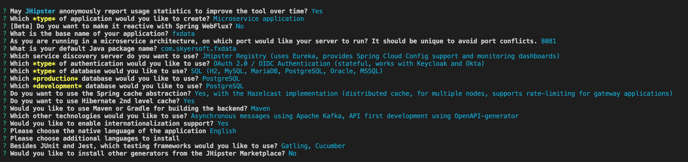

# How to replicate this work
## Setup the development environment
### Install Jhipster[https://www.jhipster.tech/installation/]
Instead of installing you can use the _devenv/docker-compose_ file for jhipster related generation tasks.
Use `dockerrun.sh` for a bash terminal in the container. Before using jhipster generator please check your directory since it is already mapped to your machines folder not hold the gnerated files inside the container.

### Install jdk 11 [AdoptOpenJDK](https://adoptopenjdk.net/)
### Install maven

## First generate the microservices
Two different microservices are enough to complete the sample architecture.
Let's say that first one is about listing the foreign exchange data and the second one is aboutthe user's trade orders. 

    mkdir fxdata
    cd fxdata
    jhipster

 